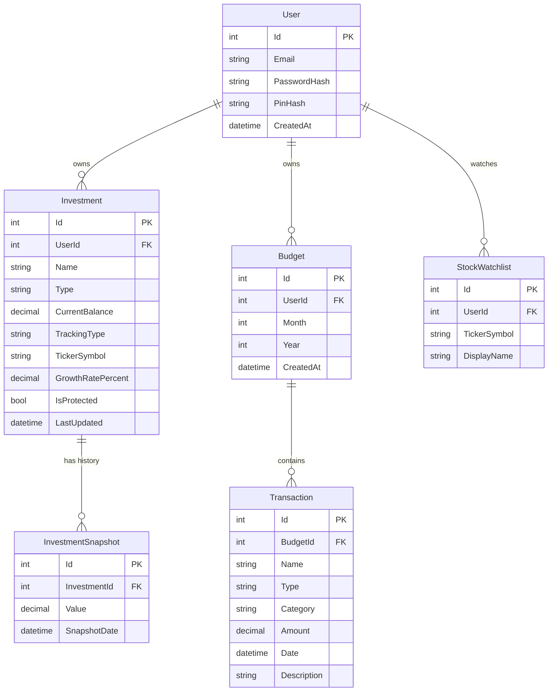

# FinanceTracker — Database Schema

## Overview

The FinanceTracker schema is designed around a single user model that can scale to a small group of users over time. Every piece of data in the system belongs to a user, secured behind JWT authentication. The schema intentionally avoids over-engineering — it covers real financial tracking needs without speculative complexity. Projected budgeting features are deliberately deferred to a later phase so the core tracking functionality can be built and validated first.

Investments are the centerpiece of the application. Each investment record stores a name, a current balance (entered manually by the user), and a tracking type that determines how its growth is calculated. Investments flagged as market-tracked carry a ticker symbol used to fetch live pricing from a financial API, while manually tracked investments rely on a user-defined annual growth percentage for projections. A boolean flag marks sensitive investments as protected, triggering a secondary PIN prompt in the UI before their values are revealed. No separate vault table is needed since this is purely a UI-level concern.

Investment snapshots exist solely to power historical charts. Rather than overwriting a balance when the user updates it, a new snapshot row is written with the date and value at that moment. The investment table always reflects the current state while the snapshot table accumulates a timeline that can be plotted as a growth curve over months and years.

The budget and transaction system handles real spending history. A budget record acts as a monthly container, grouping all financial activity for a given month and year. Transactions belong to a budget and can represent either income or expenses, distinguished by a type field. A single transaction model covers everything from a regular paycheck to a bonus to a grocery run, with a category field for grouping and a description for context. At the end of any given month the budget provides a clear picture of total income, total spending, and what was left over.

The stock watchlist is a lightweight preference table. It stores nothing more than the ticker symbols a user wants displayed on their dashboard alongside a human-readable display name. All actual market data, prices, and percentage changes are fetched live from a third-party API at render time and never persisted to the database.

## Entity Relationship Diagram

